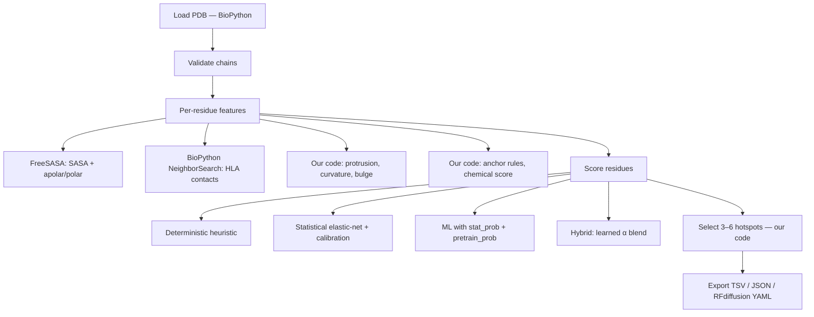

# pmhc-hotspot

**Predict TCR-binding hotspots on peptide–MHC complexes for structure-guided TCR-mimetic binder design.**

[](https://www.python.org/)
[](https://github.com/vmbharanidharan-ai/hotspot-identification/actions/workflows/ci.yml)
[](LICENSE)

**Quick links:** [Installation](#installation) · [Quick start](#quick-start) · [How it works](#how-it-works) · [Design philosophy](#design-philosophy) · [Performance](#performance--validation) · [FAQ](#faq)

---

## Table of contents

1. [Overview](#overview)
2. [What this tool does (and doesn't do)](#what-this-tool-does-and-doesnt-do)
3. [Design philosophy](#design-philosophy)
4. [Installation](#installation)
5. [Quick start](#quick-start)
6. [How it works](#how-it-works)
7. [Using the ML model](#using-the-ml-model)
8. [Command-line reference](#command-line-reference)
9. [Python API](#python-api)
10. [Performance & validation](#performance--validation)
11. [Biological validation](#biological-validation)
12. [Limitations & caveats](#limitations--caveats)
13. [RFdiffusion integration](#rfdiffusion-integration)
14. [Troubleshooting](#troubleshooting)
15. [FAQ](#faq)
16. [Development](#development)
17. [Citation](#citation)
18. [License](#license)

---

## Overview

### The problem

Designing **TCR-mimetic binders** (proteins that recognize pMHC like a TCR) requires knowing which peptide residues are contacted by TCRs—the **hotspots**. This is difficult because:

1. Many peptide positions anchor the peptide in the MHC groove rather than facing the TCR.
2. Curated TCR–pMHC structural data are sparse (on the order of tens to low hundreds of complexes in the PDB).
3. TCR recognition is specific; different TCRs can contact the same peptide differently.

### The solution

**pmhc-hotspot** combines structural biology, immunology, and optional machine learning to answer:

> **Which peptide residues should a TCR-mimetic binder contact?**

It:

- **Ranks residues** using structure-based features (FreeSASA exposure, geometry, MHC burial)
- **Refines with ML** (optional) using models trained on TCR-contact labels from PDB structures
- **Applies biological filters** (allele-aware anchor down-weighting, hydrophobic design rules)
- **Selects 3–6 hotspots** for binder design
- **Exports RFdiffusion inputs** (hotspot tokens + contig templates)

### Pipeline placement

```
structure → (manual guesswork) → RFdiffusion hotspots → RFdiffusion
                    ↓
structure → pmhc-hotspot → ranked residues + patches + export → RFdiffusion
```

### Why use this?

- **No TCR sequence required** — predicts from pMHC structure alone
- **Fast** — scores a typical pMHC complex in under a second
- **Biologically grounded** — MHC anchor rules, burial, hydrophobic design constraints
- **ML-enhanced (optional)** — staged pretrain + structural fine-tune; hybrid scoring at inference
- **RFdiffusion-ready** — `ppi.hotspot_res` tokens and contig strings
- **Transparent** — per-residue score breakdown via `explain`
- **Built on proven tools** — FreeSASA, BioPython, scikit-learn/XGBoost

> **Important:** This is **structural design prioritization**, not a predictor of T-cell activation, immunogenicity, or MHC binding affinity.

---

## What this tool does (and doesn't do)

### Does

| Capability | Description |
|------------|-------------|
| TCR-contact ranking | Score peptide residues for TCR-facing likelihood from a PDB structure |
| Hotspot selection | Pick **3–6** residues with biological filters for RFdiffusion |
| Feature explanations | Weighted breakdown per residue (SASA, protrusion, anchor penalty, …) |
| RFdiffusion export | Hotspot tokens, contig template, YAML helper |
| MHC-I alleles | Curated anchor table (HLA-A/B/C common alleles + generic fallback) |
| Benchmarking | TCR-contact recovery on a curated manifest with tiered contact definitions |
| ML training | Two-stage pipeline: IEDB pretrain → structural TCR-contact fine-tune |

### Doesn't

| Limitation | Use instead |
|------------|-------------|
| Predict immunogenicity / T-cell activation | Epitope predictors, functional assays |
| Score MHC binding affinity | NetMHCpan, MHCflurry |
| Model TCR V/J-specific contacts | TCR sequence–peptide predictors (NetTCR, etc.) |
| Design binder scaffolds | RFdiffusion or other generative design tools |
| Run without 3D coordinates | Sequence-only tools |
| Guarantee experimental success | SPR, ELISA, cell assays |

### Appropriate use cases

| Suitable | Not suitable |
|----------|--------------|
| Rank residues for TCR-mimetic binder targeting | Predict TCR binding without structure |
| Guide RFdiffusion `ppi.hotspot_res` selection | Identify immunodominant epitopes from sequence alone |
| Explore peptide–MHC–TCR interfaces | Design MHC molecules |
| Benchmark structure-based contact recovery | Predict cross-reactive TCR specificity |

---

## Design philosophy

**pmhc-hotspot separates commodity structural calculations from domain-specific hotspot logic.**

### Outsourced (community tools)

| Task | Tool | Why |
|------|------|-----|
| SASA | [FreeSASA](https://github.com/mittinatten/freesasa) | Peer-reviewed, fast; residue apolar/polar splits |
| Contact detection | BioPython `NeighborSearch` | Spatial indexing for HLA and TCR contacts |
| PDB parsing | BioPython | Standard structural I/O |
| ML (optional) | scikit-learn / XGBoost | Small-data tabular models with grouped CV |

### Our contribution (novel IP)

| Component | What it does |
|-----------|--------------|
| Statistical scorer | Elastic-net logistic + Platt calibration on structural labels |
| TCR-contact ML | Nonlinear layer with `stat_prob` + optional `pretrain_prob`; learned hybrid α |
| Hotspot selection | 3–6 residues; Pro/Gly filters; scaled hydrophobic rules; soft anchor down-weight |
| Geometry features | Protrusion, curvature, bulge — TCR-facing peptide geometry |
| Allele biochemistry | Anchor suppression, exposure priors, chemical hierarchy |
| RFdiffusion bridge | Token export and contig templates |

### Processing pipeline



---

## Installation

### Requirements

- Python **3.9+**
- **FreeSASA** (installed automatically via pip/conda dependencies)
- **Biopython**, NumPy, SciPy, pandas

### pip (recommended)

```bash
git clone https://github.com/vmbharanidharan-ai/hotspot-identification.git
cd hotspot-identification
pip install -e .
```

Development + ML extras:

```bash
pip install -e ".[dev,ml]"
```

### conda

```bash
conda env create -f environment.yml
conda activate pmhc-hotspot
# or: conda install -c conda-forge freesasa biopython
```

Build from the bundled recipe:

```bash
conda build conda/
```

---

## Quick start

### CLI

```bash
# Score hotspots → TSV (+ optional JSON)
pmhc-hotspot run complex.pdb --allele HLA-A*02:01 --out hotspots.tsv --json-out hotspots.json

# Per-residue explanation
pmhc-hotspot explain complex.pdb --allele HLA-A*02:01

# RFdiffusion YAML template
pmhc-hotspot export-rfdiffusion complex.pdb design_config.yaml

# Structure validation only
pmhc-hotspot validate complex.pdb
```

### Python

```python
from pmhc_hotspot import HotspotPredictor

predictor = HotspotPredictor(
    allele="HLA-A*02:01",
    mutation_positions=[4],  # 0-based; P5 in 1-based notation
)

result = predictor.predict("complex.pdb")

print(result.peptide_sequence)
print(result.rfdiffusion_hotspot_res)   # e.g. "C4,C5,C6,C7,C8"
print(result.contig_template)           # e.g. "C1-9/0 A1-275/0 50-80"

for h in result.hotspots:
    print(h.position, h.aa, f"{h.score:.3f}")
```

### ML-enhanced prediction

```python
predictor = HotspotPredictor(
    allele="HLA-A*02:01",
    ml_bundle="data/models/staged_xgb.joblib",
    scoring_mode="hybrid",  # deterministic | statistical | ml | hybrid
)
result = predictor.predict("complex.pdb")
```

---

## How it works

### 1. Structure loading and validation

- Parse PDB/mmCIF with Biopython
- Auto-detect peptide (8–15 aa) and HLA chains (override with `--peptide-chain` / `--hla-chain`)
- Warn on missing atoms, altlocs, low-confidence regions

### 2. Feature extraction

| Feature | Source | Role |
|---------|--------|------|
| Relative SASA | FreeSASA | Solvent exposure / TCR accessibility |
| Apolar / polar SASA fractions | FreeSASA + `surface.py` | Hydrophobic vs polar exposed area |
| HLA contact count | BioPython `NeighborSearch` | MHC groove burial proxy |
| Peptide neighbor contacts | BioPython `NeighborSearch` | Local packing |
| Protrusion, curvature, bulge | Our geometry code | TCR-facing bulge / backbone shape |
| TCR exposure prior | Our code | Central positions (P3–P8) + chemistry |
| Chemical score | Our code | W/R/Y/F/K hierarchy from PPI literature |
| Mutation proximity | Our code | Optional neoantigen bias |
| Confidence | Our code | B-factor / occupancy down-weight |
| Anchor penalty | Our code | Allele-aware soft suppression |

Features are **min–max normalized within each peptide** before scoring.

### 3. Four-layer scoring stack

```text
Layer 0 — Features        FreeSASA, NeighborSearch, geometry, allele rules
Layer 1 — Heuristic       Hand-weighted HotspotScorer (bootstrap baseline)
Layer 2 — Statistical     Elastic-net logistic + Platt calibration → P_stat
Layer 3 — ML              XGBoost/logistic on features + stat_prob (+ pretrain_prob)
Blend     — Hybrid        α·P_stat + (1−α)·P_ML  (α learned on OOF predictions)
```

#### Layer 1: Deterministic heuristic (bootstrap)

Fixed weights in `pmhc_hotspot/constants.py` — fast, interpretable, no training data:

| Feature | Weight |
|---------|--------|
| SASA | 25% |
| Protrusion | 18% |
| Low HLA contact | 12% |
| Mutation proximity | 12% |
| TCR exposure prior | 10% |
| Curvature | 8% |
| Bulge | 8% |
| Chemical score | 5% |
| Confidence | 2% |

```
base = Σ (weight_i × normalized_feature_i)
final_score = clamp(base × (1 − anchor_penalty), 0, 1)
```

Use `scoring_mode="deterministic"` for this path.

#### Layer 2: Statistical scorer (learned linear model)

- **Model:** elastic-net logistic regression (`penalty=elasticnet`, `solver=saga`)
- **Features:** structural columns only (no `stat_prob` / `pretrain_prob`)
- **Calibration:** Platt scaling (`CalibratedClassifierCV`, sigmoid) by default
- **Output:** `P_stat(contact)` per residue — replaces hand-tuned weights for ranking

Use `scoring_mode="statistical"` with a saved bundle.

#### Layer 3: Nonlinear ML

- **Model:** XGBoost (default) or logistic on augmented features
- **Extra inputs:** `stat_prob` from layer 2; optional `pretrain_prob` from IEDB stage 1
- **Calibration:** Platt scaling on the final estimator

Use `scoring_mode="ml"`.

#### Hybrid blend (learned α)

During `ml-staged`, out-of-fold `P_stat` and `P_ML` are combined:

```
P_hybrid = α · P_stat + (1 − α) · P_ML
```

`α` is chosen by grid search to maximize ROC-AUC on grouped OOF predictions (not a fixed 0.6). Use `scoring_mode="hybrid"`.

### 4. Hotspot selection (our algorithm)

- Softly **down-weight** anchor positions (not hard-excluded); stronger penalty when buried
- Skip Pro, Gly; skip N-terminal Ala/Gly
- Prefer central TCR-facing positions
- Select **3–6** hotspots; scale hydrophobic requirement for smaller sets
- Emit contiguous **patches** for spatially coherent targeting

### 5. Inference scoring modes

| `scoring_mode` | Ranking score |
|----------------|---------------|
| `deterministic` | Heuristic weighted sum (layer 1) |
| `statistical` | Calibrated elastic-net `P_stat` (layer 2) |
| `ml` | Calibrated ML `P_ML` (layer 3) |
| `hybrid` | Learned α blend of statistical + ML |

---

## Using the ML model

### Train and save

```bash
pmhc-hotspot ml-staged \
  --iedb data/iedb.csv \
  --manifest src/pmhc_hotspot/benchmark/tcr_pmhc_manifest.yaml \
  --download \
  --model xgboost \
  --contact-mode standard \
  --save-model data/models/staged_xgb.joblib
```

`--contact-mode` controls TCR-contact **ground-truth labels** (`strict` | `standard` | `permissive`). Use **`standard`** for training and primary reporting.

### Benchmark with ML

```bash
# Deterministic baseline
pmhc-hotspot benchmark --download --contact-mode standard --scoring-mode deterministic

# Statistical layer only (requires bundle with statistical_model)
pmhc-hotspot benchmark --download --contact-mode standard \
  --scoring-mode statistical \
  --ml-bundle data/models/staged_xgb.joblib

# Hybrid: learned α · P_stat + (1−α) · P_ML
pmhc-hotspot benchmark --download --contact-mode standard \
  --scoring-mode hybrid \
  --ml-bundle data/models/staged_xgb.joblib
```

### Leave-structures-out validation

```bash
pmhc-hotspot ml-holdout \
  --iedb data/iedb.csv \
  --download \
  --contact-mode standard \
  --scoring-mode hybrid \
  --hold-out 5C0B --hold-out 3QDG \
  --save-model data/models/holdout_xgb.joblib
```

### Other ML commands

```bash
pmhc-hotspot ml-pretrain --iedb data/iedb.csv --model xgboost
pmhc-hotspot ml-fine-tune --iedb data/iedb.csv --download --contact-mode standard
pmhc-hotspot ml-train --download --contact-mode standard
```

> Public IEDB labels are **pretraining signal only** (peptide binding), not residue-level TCR-contact truth. Structural labels come from the benchmark manifest.

---

## Command-line reference

| Command | Description |
|---------|-------------|
| `run STRUCTURE` | Score hotspots → TSV (+ optional JSON) |
| `explain STRUCTURE` | Per-residue score breakdown |
| `export-rfdiffusion STRUCTURE OUTPUT.yaml` | RFdiffusion config template |
| `validate STRUCTURE` | Structure checks without scoring |
| `benchmark` | TCR-contact recovery on manifest |
| `ml-pretrain` | Stage 1: public binding data CV |
| `ml-fine-tune` | Stage 2: structural residue labels |
| `ml-staged` | Full two-stage training + optional `--save-model` |
| `ml-holdout` | Leave-structures-out train + evaluate |
| `ml-train` | Grouped CV on structural features only |

### `benchmark` options (key)

```bash
pmhc-hotspot benchmark \
  --manifest src/pmhc_hotspot/benchmark/tcr_pmhc_manifest.yaml \
  --download \
  --contact-mode standard \
  --scoring-mode deterministic \
  --ml-bundle path/to/model.joblib \
  --out benchmark_report.json
```

### `run` options (key)

```bash
pmhc-hotspot run complex.pdb \
  --allele HLA-A*02:01 \
  --mutation P5 \
  --peptide-chain C \
  --hla-chain A \
  --out hotspots.tsv \
  --json-out hotspots.json
```

---

## Python API

### `HotspotPredictor`

| Parameter | Type | Description |
|-----------|------|-------------|
| `allele` | `str \| None` | HLA allele (`HLA-A*02:01`, `HLA-A02:01`, …) |
| `mutation_positions` | `list[int]` | 0-based peptide indices with mutations |
| `weights` | `dict` | Override `DEFAULT_WEIGHTS` |
| `peptide_chain` / `hla_chain` | `str \| None` | Force chain IDs (auto-detect if `None`) |
| `hotspot_config` | `dict` | `min_hotspots`, `max_hotspots`, `min_hydrophobic`, … |
| `ml_bundle` | path or `StagedModelBundle` | Saved staged model for ML/hybrid scoring |
| `scoring_mode` | `str` | `deterministic`, `statistical`, `ml`, or `hybrid` |

### `PredictionResult`

| Field | Description |
|-------|-------------|
| `residue_scores` | All peptide residues, ranked by score (or hybrid rank) |
| `hotspots` | Final RFdiffusion hotspot set (3–6 residues) |
| `patches` | Contiguous high-scoring surface patches |
| `rfdiffusion_hotspot_res` | Comma-separated `ChainResnum` tokens |
| `contig_template` | RFdiffusion contig string |
| `metadata` | Warnings, anchor positions, scoring mode, method version |

```python
result = HotspotPredictor(allele="HLA-A*02:01").predict("complex.pdb")
report = HotspotPredictor().benchmark(download=True, contact_mode="standard")
frame = HotspotPredictor().build_ml_training_frame(download=True, contact_mode="standard")
```

---

## Performance & validation

Benchmark manifest: **11** curated TCR-bound pMHC structures (`tcr_pmhc_manifest.yaml`). Metrics use **`standard`** contact mode (≤4.5 Å with side-chain involvement, or ≤3.5 Å backbone pairs).

### Deterministic heuristic (representative run)

| Metric | All | 8–9 mer | 10–11 mer |
|--------|-----|---------|-----------|
| Recall@5 | **0.679** | **0.81** | **0.57** |
| Precision@5 | 0.89 | — | — |
| Anchor avoidance@5 | 1.00 | — | — |

### ML training (IEDB-only pretrain, XGBoost, standard labels)

| Stage | Metric |
|-------|--------|
| Stage 1 pretrain (IEDB) | ROC-AUC **0.731** |
| Stage 2 finetune (structural CV) | ROC-AUC **0.798** |

Finetune CV AUC measures **residue-level contact classification** on the training manifest; benchmark recall@5 measures **top-5 ranking** against TCR contacts — these are related but not identical.

### Contact-mode sensitivity (same predictor, different ground truth)

| Contact mode | Mean contacts / peptide | Recall@5 |
|--------------|-------------------------|----------|
| permissive | ~7.4 | ~0.66 |
| **standard** | ~6.7 | **~0.69** |
| strict | ~2.5 | ~0.74 (inflated — fewer labels) |

Use **`standard`** for training and primary reporting.

### Interpretation

- **Recall@5 ~0.68:** Of true TCR-contact residues, roughly two-thirds appear in the top-5 predictions — better than random, not perfect.
- **Length gap:** 8–9 mers are easier (snug groove geometry); 10–11 mers bulge more and are harder.
- **ML:** Improves finetune AUC; re-benchmark with `--scoring-mode hybrid` after training to see if ranking improves on your holdout set.

---

## Biological validation

### TCR recognition sketch

```
              TCR
             /|\
            / | \
    ┌───────────────────┐
    │  MHC-I groove      │
    │  ┌─────────────┐  │
    │  │ P2 … PΩ     │  │  P2, PΩ: anchors (often buried)
    │  │   P4 P5 P7  │  │  P4–P8: common TCR contacts
    │  └─────────────┘  │
    └───────────────────┘
```

### Anchor handling (v0.3+)

- **Older approach:** Hard-exclude buried anchors → false negatives on non-canonical cases.
- **Current approach:** **Soft down-weight** via `AnchorFilter.selection_multiplier()` (floor 0.15×); exposed anchors penalized less than buried anchors.
- Hotspot selection and scoring both use soft penalties; anchors can still rank highly when structurally justified.

### Feature rationale

| Feature | Evidence | Usage |
|---------|----------|-------|
| SASA | Strong | Exposed residues more TCR-accessible (FreeSASA) |
| Protrusion / bulge | Medium | Central bulge often TCR-contacted |
| HLA contacts | Medium | Burial in groove; inverted in score |
| P3–P8 prior | Strong | Central positions enriched in TCR footprints |
| Hydrophobic chemistry | Medium | PPI hotspot hierarchy (W/R/Y/F/…) |
| Apolar SASA fraction | Medium | FreeSASA apolar/polar split for ML features |

---

## Limitations & caveats

1. **Small structural training set** — 11 PDBs in the default manifest; generalization to unseen alleles/structures is limited. Use `ml-holdout` before trusting ML on new data.
2. **HLA-A\*02:01 bias** — Most benchmark structures are A\*02:01; other alleles use generic or curated rules with less validation.
3. **Generic TCR contacts** — Labels come from *a* TCR in the crystal structure, not your clonotype of interest.
4. **Peptide length** — 10–11 mers show lower recall@5 than 8–9 mers.
5. **No immunogenicity** — Hotspots ≠ immunodominance.
6. **Assumes MHC binding** — Input peptide should already be a plausible binder (validate with NetMHCpan/MHCflurry first).
7. **Structure quality** — Missing atoms, high B-factors, or low-confidence regions reduce reliability (`validate` + `explain`).
8. **RFdiffusion loop unvalidated** — Hotspot export is provided; designed binder contact rates are not yet systematically benchmarked in this package.

### Recommended ensemble workflow

1. **MHC binding** — NetMHCpan / MHCflurry  
2. **Hotspots** — pmhc-hotspot (this package)  
3. **Immunogenicity** — IEDB tools / netCTL (if relevant)  
4. **Design** — RFdiffusion with exported hotspots  
5. **Validation** — MD, docking, SPR/ELISA, cellular assays  

---

## RFdiffusion integration

### Workflow

```bash
# 1. Score and inspect
pmhc-hotspot run 1BD2.pdb --allele HLA-A*02:01 --json-out hotspots.json

# 2. Export YAML template
pmhc-hotspot export-rfdiffusion 1BD2.pdb rfdiffusion_config.yaml

# 3. Use tokens in RFdiffusion (verify against your RFdiffusion version)
#    ppi.hotspot_res from JSON/YAML output
#    contig from result.contig_template
```

### Exported artifacts

1. **`ppi.hotspot_res`** — comma-separated chain+residue tokens, e.g. `C4,C5,C6,C7,C8`
2. **Contig template** — fixes peptide + HLA, defines binder length range, e.g. `C1-9/0 A1-275/0 50-80`
3. **YAML helper** — starter config (formats evolve across RFdiffusion versions — treat as a template)

Example YAML fragment:

```yaml
ppi:
  hotspot_res: C4,C5,C6,C7,C8
  target_chains: [A]
contigmap:
  contigs: C1-9/0 A1-275/0 50-80
  num_designs: 100
```

---

## Troubleshooting

**`ImportError: FreeSASA is not installed`**

```bash
pip install freesasa
# or
conda install -c conda-forge freesasa
pip install -e .
```

**`No such option '--contact-mode'` on `ml-staged`**

Pull the latest `main` (v0.3+). Older installs only had `--contact-mode` on `benchmark`.

**`--ml-bundle is required when --scoring-mode is ml or hybrid`**

Train and save a model first (`ml-staged --save-model …`) or pass an existing `.joblib` bundle.

**`Could not resolve peptide/MHC/TCR chains`**

Specify chains explicitly:

```bash
pmhc-hotspot run complex.pdb --peptide-chain C --hla-chain A --allele HLA-A*02:01
```

**Low scores on expected hotspots**

```bash
pmhc-hotspot validate complex.pdb
pmhc-hotspot explain complex.pdb --allele HLA-A*02:01
```

Check B-factors, missing side chains, and whether the residue is a buried anchor.

**ML does not beat heuristic on benchmark**

Compare modes explicitly:

```bash
pmhc-hotspot benchmark --download --scoring-mode deterministic --out det.json
pmhc-hotspot benchmark --download --scoring-mode hybrid \
  --ml-bundle data/models/staged_xgb.joblib --out hybrid.json
```

If gains are within noise, the deterministic path is simpler and fully interpretable.

---

## FAQ

**Do I need a TCR sequence?**  
No. Predictions use pMHC structure only. TCR information is implicit in structural training labels.

**Which structures work best?**  
X-ray (≤2.5 Å) or high-quality cryo-EM. Run `pmhc-hotspot validate` first.

**MHC-II support?**  
Not yet. This release targets MHC-I peptides (8–15 aa).

**What does recall@5 mean?**  
If a TCR contacts several peptide residues, what fraction appear in our top-5 ranked positions?

**Why are 10-mers harder?**  
Longer peptides often bulge out of the groove; geometry and contact patterns are less canonical.

**Can I train on my own labeled structures?**  
Yes — add entries to a manifest YAML and use `ml-staged` / `ml-holdout`. See `src/pmhc_hotspot/benchmark/tcr_pmhc_manifest.yaml` for the schema.

**Does this replace RFdiffusion?**  
No. pmhc-hotspot **selects hotspots**; RFdiffusion **generates binders** conditioned on them.

---

## Development

```bash
git clone https://github.com/vmbharanidharan-ai/hotspot-identification.git
cd hotspot-identification
pip install -e ".[dev,ml]"

pytest
pytest --cov=pmhc_hotspot --cov-report=term-missing
ruff check src tests
black --check src tests
```

### Project layout

```
src/pmhc_hotspot/
├── api.py                 # HotspotPredictor
├── cli.py                 # Command-line interface
├── features/
│   ├── sasa.py            # FreeSASA wrapper
│   ├── spatial.py         # BioPython NeighborSearch helpers
│   ├── surface.py         # Apolar/polar surface fractions
│   ├── contacts.py        # HLA / peptide contact counts
│   └── geometry.py        # Protrusion, curvature, bulge (our code)
├── scoring/               # Baseline scorer, patches, selection (our code)
├── ml/                    # Staged training, hybrid inference, persistence
└── benchmark/             # Manifest, contact labels, holdout validation
```

### Roadmap

| Item | Status |
|------|--------|
| FreeSASA + NeighborSearch refactor | ✅ v0.3 |
| Statistical layer + calibration + learned hybrid α | ✅ v0.3.1 |
| ML inference + hybrid scoring | ✅ v0.3 |
| Soft anchor suppression | ✅ v0.3 |
| Leave-structures-out validation | ✅ v0.3 |
| Multi-allele expansion | Planned |
| MHC-II support | Planned |
| RFdiffusion design contact benchmarking | Planned |

---

## Citation

If you use pmhc-hotspot in research, please cite:

```bibtex
@software{pmhc_hotspot2026,
  title  = {pmhc-hotspot: Structure-guided TCR-contact hotspot selection for peptide-MHC binder design},
  author = {Bharanidharan, Vedha},
  year   = {2026},
  url    = {https://github.com/vmbharanidharan-ai/hotspot-identification},
  version = {0.3.0}
}
```

### Dependencies to cite

- **FreeSASA:** Mitternacht S. *F1000Research* 2016;5:189  
- **BioPython:** Cock PJA et al. *Bioinformatics* 2009;25(3):422–423  
- **XGBoost:** Chen T, Guestrin C. KDD 2016  

### Key references

- Rudolph MG et al. — MHC-I peptide/TCR structural biology  
- Watson JL et al. (2023) — RFdiffusion PPI hotspot conditioning  
- NetMHCpan motif tables — allele anchor curation  

---

## License

MIT License — see [LICENSE](LICENSE).

---

**Version:** 0.3.0 · **Last updated:** June 2025 · **Status:** Active development; feedback welcome via [GitHub Issues](https://github.com/vmbharanidharan-ai/hotspot-identification/issues).
